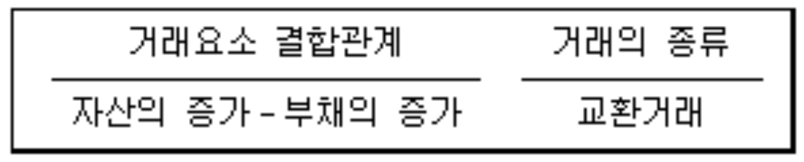
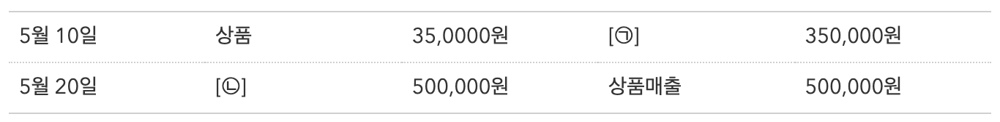
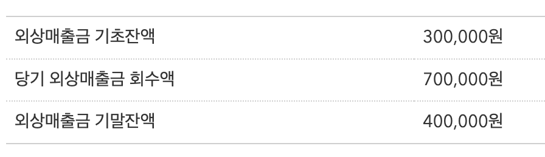
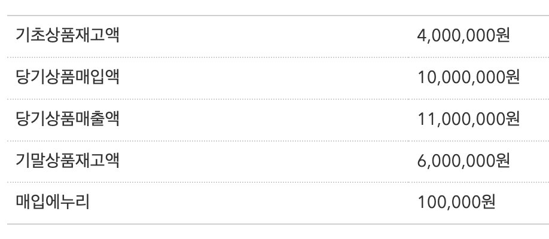
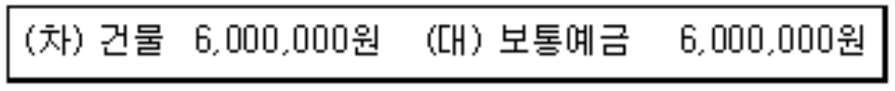

public:: false

- 다음 중 일반기업회계기준에서 규정하고 있는 재무제표가 아닌 것은? #card #전산회계/2급
  card-last-interval:: 4
  card-repeats:: 2
  card-ease-factor:: 2.36
  card-next-schedule:: 2024-04-01T21:43:26.750Z
  card-last-reviewed:: 2024-03-28T21:43:26.751Z
  card-last-score:: 3
  id:: 66036a5b-8dd7-4b4a-b0a0-2e6c296da362
  1. 합계잔액시산표
  2. 재무상태표
  3. 손익계산서
  4. 주석
	- 1.합계잔액시산표
		- 재무제표는 재무상태표, 손익계산서, 현금흐름표, 자본변동표로 구성되며, 주석을 포함한다.
- 다음 중 일정 시점의 재무상태를 나타내는 재무보고서의 계정과목으로만 짝지어진 것이 아닌 것은? #card #전산회계/2급 
  card-last-interval:: -1
  card-repeats:: 1
  card-ease-factor:: 2.5
  card-next-schedule:: 2024-03-27T15:00:00.000Z
  card-last-reviewed:: 2024-03-26T22:27:40.830Z
  card-last-score:: 1
  id:: 66036a5b-1846-40ad-a4d9-8dc10dcdb8c1
  collapsed:: true
  1.	보통예금, 현금
  2.	선급비용, 선수수익
  3.	미수수익, 미지급비용
  4.	감가상각비, 급여
	- 4.감가상각비, 급여
		- 재무보고서의 계정과목은 자산, 부채, 자본이다.
		- 1. 보통예금(자산), 현금(자산)
		  2. 선급비용(자산), 선수수익(부채)
		  3. 미수수익(자산), 미지급비용(부채)
		  4. 감가상각비(비용), 급여(비용)
- 다음 거래요소의 결합관계와 거래의 종류에 맞는 거래내용은? #card #전산회계/2급
  id:: 66036a5b-9247-4adc-9595-7357d6f01841
  card-last-interval:: -1
  card-repeats:: 1
  card-ease-factor:: 2.5
  card-next-schedule:: 2024-03-28T15:00:00.000Z
  card-last-reviewed:: 2024-03-28T06:05:34.193Z
  card-last-score:: 1
  collapsed:: true
   
  1.	업무용 컴퓨터 1,500,000원을 구입하고 대금은 나중에 지급하기로 하다.
  2.	거래처로부터 외상매출금 500,000원을 현금으로 받다.
  3.	거래처에 외상매입금 1,000,000원을 현금으로 지급하다.
  4.	이자비용 150,000원을 현금으로 지급하다.
	- 1.	업무용 컴퓨터 1,500,000원을 구입하고 대금은 나중에 지급하기로 하다.
		- | 업무용 컴퓨터 구입 (자산증가) | 대금 나중에 지급 (부채증가) |
		  재화가 교환되므로 교환거래이다.
- 아래의 괄호 안에 각각 들어갈 계정과목으로 옳은 것은? #card #전산회계/2급
  id:: 660407a5-e796-4f1b-a48d-4edab7a1bcce
  card-last-interval:: -1
  card-repeats:: 1
  card-ease-factor:: 2.5
  card-next-schedule:: 2024-03-28T15:00:00.000Z
  card-last-reviewed:: 2024-03-27T15:17:24.314Z
  card-last-score:: 1
  **거래**
  * 05월 10일 (주)무릉으로부터 상품 350,000원을 매입하고, 대금은 당좌수표를 발행하여 지급하다.
  * 05월 20일 (주)금강에 상품 500,000원을 공급하고, 대금은 매입처 발행 당좌수표로 받다.
  **분개**
   
       1.	㉠：당좌예금, ㉡：당좌예금
       2.	㉠：당좌예금, ㉡：현금
       3.	㉠：현금, ㉡：현금
       4.	㉠：현금, ㉡：당좌예금
	- 2.	㉠：당좌예금, ㉡：현금
		- 당좌수표의 회계처리 
		  1.당사가 당좌수표 발행 시 당좌예금 계정을 대변에 분개한다: 당좌수표 발행 → 당좌예금 잔고 감소 → 자산의 감소 → 대변 분개
		  2.타인발행 당좌수표는 현금 계정: 언제든지 현금으로 바꿀 수 있는 통화대용증권 → 타인발행 당좌수표 수령 시 자산의 증가이므로 현금 계정을 차변으로 분개, 보유하고 있던 타인발행 당좌수표를 대금 결제에 사용하면 자산의 감소이므로 현금 계정을 대변으로 분개
- 다음 자료를 이용하여 당기 외상 매출액을 계산하면 얼마인가? #card #전산회계/2급
  id:: 66042313-6a37-46c9-8edd-8dbc53420a6a
  card-last-interval:: 4
  card-repeats:: 1
  card-ease-factor:: 2.36
  card-next-schedule:: 2024-04-01T06:01:33.627Z
  card-last-reviewed:: 2024-03-28T06:01:33.628Z
  card-last-score:: 3
  
	- 800,000원
		- 기초잔액 - 회수액 + 기말잔액
- 다음의 자산 항목을 유동성이 높은 순서대로 바르게 나열하라. #card #전산회계/2급
  id:: 66042384-9767-4836-9825-7e1ed9f0ce58
  card-last-interval:: -1
  card-repeats:: 1
  card-ease-factor:: 2.5
  card-next-schedule:: 2024-03-28T15:00:00.000Z
  card-last-reviewed:: 2024-03-28T06:00:08.892Z
  card-last-score:: 1
  상품 / 토지 / 개발비 / 미수금
	- 미수금 / 상품 / 토지 / 개발비
		- 당좌자산-재고자산-유형자산-무형자산 순
- 다음의 회계정보를 이용하여 기말의 상품매출총이익을 계산하라 #card #전산회계/2급
  id:: 660423b6-4bd8-49cf-ac91-9a01263331ad
  card-last-interval:: 3.58
  card-repeats:: 1
  card-ease-factor:: 2.6
  card-next-schedule:: 2024-03-31T19:02:18.219Z
  card-last-reviewed:: 2024-03-28T06:02:18.220Z
  card-last-score:: 5
  
	- 3,100,000원
		- 매입에누리는 매입하는 과정에서 판매자가 상품 가격을 깎아주는 것을 의미한다. 이 경우 해당 금액을 수익으로 인지하는 것이 아닌 매입원가를 낮게 잡아 회계처리한다.
		- 당기상품매입액 - 매입애누리 = 당기순상품매입액(9,900,000원)
		  기초상품재고액 + 당기순상품매입액 - 기말상품재고액 = 상품매출원가(7,900,000원)
		  당기상품매출액 - 상품매출원가 = 상품매출총이익(3,100,000원)
- 다음의 회계자료에 의한 당기총수익은 얼마인가? #card #전산회계/2급
  id:: 6604331f-20df-44d4-9ff0-f87666bb90f2
  card-last-interval:: -1
  card-repeats:: 1
  card-ease-factor:: 2.5
  card-next-schedule:: 2024-03-28T15:00:00.000Z
  card-last-reviewed:: 2024-03-27T15:16:31.028Z
  card-last-score:: 1
  * 기초자산 800,000원
  * 기초자본 600,000원
  * 당기총비용 1,100,000원
  * 기말자본 1,000,000원
	- 1,500,000원
		- 기초자산+기초자본+당기총비용-기말자본=당기총수익(1,500,000원)
- 다음 중 상품의 매입원가에 가산하지 않는 것은? #card #전산회계/2급
  id:: 6604331f-fa52-4103-a50e-c2fa7ecb4096
  card-last-interval:: -1
  card-repeats:: 1
  card-ease-factor:: 2.5
  card-next-schedule:: 2024-03-28T15:00:00.000Z
  card-last-reviewed:: 2024-03-28T06:03:16.759Z
  card-last-score:: 1
  
       1.	상품을 100,000원에 매입하다.
       2.	상품 매입 시 발생한 하역비 100,000원을 지급하다.
       3.	상품 매입 시 발생한 운임 100,000원을 지급하다.
       4.	매입한 상품에 하자가 있어 100,000원에 해당하는 상품을 반품하다.
	- 4.	매입한 상품에 하자가 있어 100,000원에 해당하는 상품을 반품하다.
		- 상품매입원가 차감: 매입에누리, 매입환출, 매입할인
- 건물 일부 파손으로 인해 유리창 교체 작업(수익적지출)을 하고, 아래와 같이 회계처리한 경우 발생하는 효과로 다음 중 옳은 것은? #card #전산회계/2급
  id:: 6604331f-d32c-40dc-a3ea-73493ffec090
  card-last-interval:: 4
  card-repeats:: 1
  card-ease-factor:: 2.36
  card-next-schedule:: 2024-04-01T06:00:39.482Z
  card-last-reviewed:: 2024-03-28T06:00:39.483Z
  card-last-score:: 3
   
       1.	부채의 과대계상
       2.	자산의 과소계상
       3.	순이익의 과대계상
       4.	비용의 과대계상
	- 3.	순이익의 과대계상
		- [수익 - 비용 = 이익] 이므로 비용이 줄면 이익이 과대계상됨
- 다음 거래에서 개인기업의 자본금계정에 영향을 미치지 않는 거래는? #card #전산회계/2급
  id:: 6604331f-a802-47bc-9b58-a0ac6a18ddd0
  card-last-interval:: 3.58
  card-repeats:: 1
  card-ease-factor:: 2.6
  card-next-schedule:: 2024-03-31T19:02:54.190Z
  card-last-reviewed:: 2024-03-28T06:02:54.191Z
  card-last-score:: 5
       1.	현금 1,000,000원을 거래처에 단기대여하다.
       2.	사업주가 단기대여금 1,000,000원을 회수하여 사업주 개인 용도로 사용하다.
       3.	결산 시 인출금 계정의 차변 잔액 1,000,000원을 정리하다.
       4.	사업주의 자택에서 사용할 에어컨 1,000,000원을 회사 자금으로 구입하다.
	- 1.	현금 1,000,000원을 거래처에 단기대여하다.
		- 1. 단기대여금(자산)
		  2. 개인용도 사용(인출금)
		  3. 인출금은 결산시 자본금으로 정리
		  4. 인출금
- 영업손익과 관련이 없는 거래는 무엇인가?#card #전산회계/2급
  id:: 6604331f-04eb-4309-b5a0-5b1002a4234f
  card-last-interval:: -1
  card-repeats:: 1
  card-ease-factor:: 2.5
  card-next-schedule:: 2024-03-28T15:00:00.000Z
  card-last-reviewed:: 2024-03-28T06:05:59.316Z
  card-last-score:: 1
       1.	영업부 급여 500,000원을 현금으로 지급하다.
       2.	상품광고를 위하여 250,000원을 보통예금으로 지급하다.
       3.	수재민을 위하여 100,000원을 현금으로 기부하다.
       4.	사무실 전기요금 150,000원을 현금으로 지급하다.
	- 3.	수재민을 위하여 100,000원을 현금으로 기부하다.
		- 영업 손익이란 기업 본래의 영업활동에 의해서 얻어진 영업수익과 수익을 얻기 위해 사용된 영업비용의 차액. 여기서 영업수익이란 일반적으로 기업의 영업성과인 매출액을 말하며, 영업비용은 매출원가와 판매비·일반관리비의 합계를 말한다. 기부는 영업외비용이다.