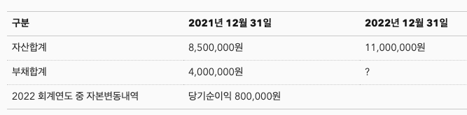

- 다음 중 일반기업회계기준상 회계의 목적에 대한 설명으로 가장 거리가 먼 것은? #card #전산회계/2급
  id:: 66043571-d9f3-4c4a-b9d5-863c1187d9b6
  card-last-interval:: -1
  card-repeats:: 1
  card-ease-factor:: 2.5
  card-next-schedule:: 2024-03-28T15:00:00.000Z
  card-last-reviewed:: 2024-03-28T05:59:51.249Z
  card-last-score:: 1
  
       1.	미래 자금흐름 예측에 유용한 회계 외 비화폐적 정보의 제공
       2.	경영자의 수탁책임 평가에 유용한 정보의 제공
       3.	투자 및 신용의사결정에 유용한 정보의 제공
       4.	재무상태, 경영성과, 현금흐름 및 자본변동에 관한 정보의 제공
	- 1.	미래 자금흐름 예측에 유용한 회계 외 비화폐적 정보의 제공
		- 미래 자금흐름 예측에 유용한 회계와 화폐적 정보의 제공
- 다음 중 보기의 거래에 대한 분개로 틀린 것은? #card #전산회계/2급
  id:: 6604357b-f825-44f5-913a-a16e7c1c5cbb
  card-last-interval:: -1
  card-repeats:: 1
  card-ease-factor:: 2.5
  card-next-schedule:: 2024-03-28T15:00:00.000Z
  card-last-reviewed:: 2024-03-28T06:04:18.561Z
  card-last-score:: 1
       1.	차용증서를 발행하고 현금 1,000,000원을 단기차입하다.
  (차) 현금 1,000,000원 (대) 단기차입금 1,000,000원
       2.	비품 1,000,000원을 외상으로 구입하다.
  (차) 비품 1,000,000원 (대) 외상매입금 1,000,000원
       3.	상품매출 계약금으로 현금 1,000,000원을 수령하다.
  (차) 현금 1,000,000원 (대) 선수금 1,000,000원
       4.	직원부담분 건강보험료와 국민연금 1,000,000원을 현금으로 납부하다.
  (차) 예수금 1,000,000원 (대) 현금 1,000,000원
	- 2.	비품 1,000,000원을 외상으로 구입하다.
	  (차) 비품 1,000,000원 (대) 외상매입금 1,000,000원
- 다음 중 일정기간 동안 기업의 경영성과를 나타내는 재무보고서의 계정과목으로만 짝지어진 것은? #card #전산회계/2급
  id:: 6604363a-51d4-48c6-a992-f761a694fec3
  card-last-interval:: -1
  card-repeats:: 1
  card-ease-factor:: 2.5
  card-next-schedule:: 2024-03-29T15:00:00.000Z
  card-last-reviewed:: 2024-03-28T21:43:16.013Z
  card-last-score:: 1
  
       1.	매출원가, 외상매입금
       2.	매출액, 미수수익
       3.	매출원가, 기부금
       4.	선급비용, 기부금
	- 3.	매출원가, 기부금
		- 매출원가(비용), 기부금(영업외비용)
- 다음 중 결산 시 손익으로 계정을 마감하는 계정과목에 해당하는 것은? #card #전산회계/2급
  id:: 66043675-1f2a-4d5b-a7ab-443fd66a362e
  card-last-interval:: -1
  card-repeats:: 1
  card-ease-factor:: 2.5
  card-next-schedule:: 2024-03-29T15:00:00.000Z
  card-last-reviewed:: 2024-03-28T21:42:38.021Z
  card-last-score:: 1
       1.	이자수익
       2.	자본금
       3.	미지급금
       4.	외상매출금
	- 이자수익
	  logseq.order-list-type:: number
		- 손익으로 계정을 마감하는 계정과목은 손익계산서이다.
		- 자본금(자본), 미지급금(부채), 외상매출금(부채)
- 아래 데이터를 보고 2022 회계연도 말 부채합계를 구하라.
  
	- 5,700,000원
		- 21년 자산 850만, 부채 400만, 자본 450만
		- 22년 자본변동내역 당기순이익 80만이면 자본이 450+80=530만이 된다.
		  1100만-530만=570만(22년 부채)
-